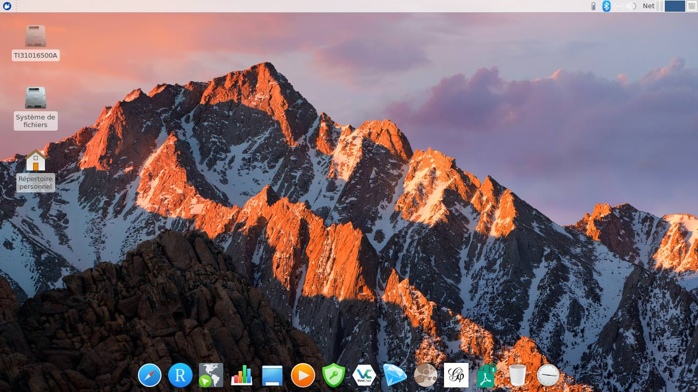

# DoBuKe
We'll see where this leads us....

## Welcome to DoBuKe

http://www.dobuke.org



## Install

First, create a Xubuntu fresh install, directly on your machine or in a VM.
Ir's light, versatile and easy to install.

Then : 

install git :
```
sudo apt-get install git
```

Clone this repo. Unzip it.
```
git clone https://github.com/hpiedcoq/dobuke.git
```
get inside the dobuke directory
```
cd dobuke
```
Do
```
chmod +x start.sh
```
Execute the start.sh script as sudo.
```
sudo ./start.sh
```

Grab a beer, it takes time...
This will install all the packages.

## To Do...

For the moment, this script installs packages and starts to tune the xfce environment.
But plenty of details have to be automatized to finalize the installation (eye-candy, menus, etc...).

Work in progress.


